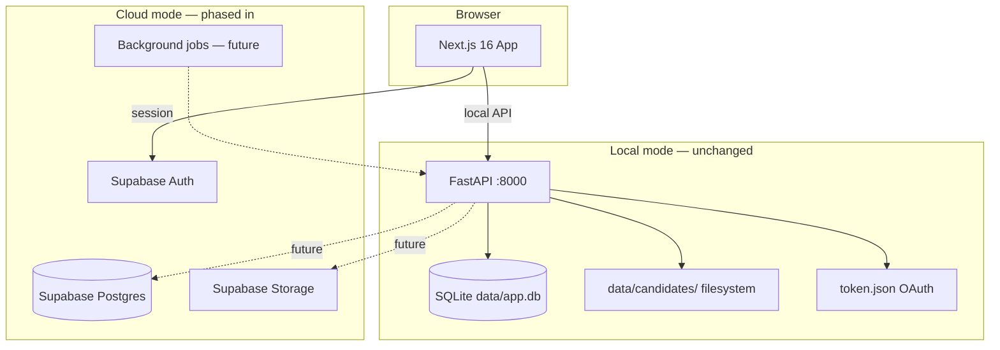

# Architecture

## Overview

Job Applicants Analyzer is evolving from a **single-user local tool** into a **multi-tenant web application** while keeping the original implementation intact until the cloud path is finalized.

## Stack

| Layer | Technology | Notes |
|-------|------------|-------|
| Frontend | Next.js 16, React 19, Tailwind 4 | Existing UI in `web/` |
| Backend | FastAPI (Python) | Existing API in `server/` |
| Local DB | SQLite | Recruiter notes, runs, email log |
| Local files | `data/candidates/` | Emails, PDFs, manifest |
| Cloud auth | Supabase Auth | Email/password + Google (optional) |
| Cloud DB | Supabase Postgres | Orgs, members, candidates (phased) |
| Cloud files | Supabase Storage | Resumes & attachments (phased) |
| Jobs | Inngest or Trigger.dev | Gmail sync workers (future) |
| Hosting | Vercel + Railway/Fly | Web + API (future) |

## Tenancy model

- **Organization** — hiring team / company workspace
- **Organization member** — user with role (`owner`, `admin`, `member`)
- All cloud data is scoped by `organization_id`
- Row Level Security (RLS) enforces isolation in Postgres

## API authentication (future)

FastAPI will validate Supabase JWTs and resolve `organization_id` from membership. Until wired, the existing API remains open on localhost (local mode).

## What stays local-only (for now)

These continue to use the original implementation:

- `scripts/fetch_emails.py` and `server/services/sync.py`
- `server/db.py` (SQLite)
- `server/services/candidates.py` (filesystem manifest)
- Desktop Gmail OAuth (`credentials.json`, `token.json`)

Cloud equivalents will be added as **new modules** under `server/cloud/` and documented separately.
