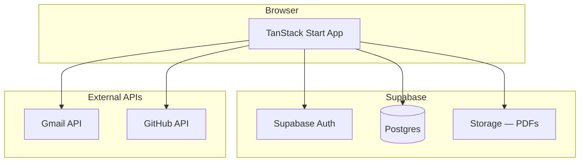

# Architecture

## Overview

Kame Pick is a **multi-tenant hiring dashboard**: Gmail sync → candidate storage → scoring → outreach. Single full-stack app on TanStack Start, backed by Supabase.

## Stack

| Layer | Technology | Path |
|-------|------------|------|
| Runtime | Bun | repo root |
| Framework | TanStack Start + Router | `src/routes/` |
| UI | React 19, Tailwind 4 | `src/components/` |
| Server | Server functions | `src/server/` |
| ORM | Drizzle | `src/db/` |
| Auth | Supabase Auth (cookie SSR) | `src/lib/supabase/` |
| Database | Supabase Postgres | `supabase/migrations/` |
| Files | Supabase Storage | candidate PDFs |
| Hosting | Vercel (Nitro) | `vercel.json` |

## Tenancy

- **Organization** — hiring team workspace
- **Organization member** — user with role (`owner`, `admin`, `member`)
- All tenant data scoped by `organization_id`
- RLS enforces isolation in Postgres and Storage

## Auth flow

- Browser: `@supabase/ssr` `createBrowserClient` (cookies)
- Server: `createServerClient` reads cookies via TanStack `getRequest()`
- Route guard: `src/server/route-auth.ts` redirects unauthenticated users to `/login`
- Signup trigger creates profile + default org (`handle_new_user` in foundation migration)

## Optional local import

`scripts/migrate-local-data.ts` imports legacy `./data/candidates/` + SQLite into Supabase (one-time). Not required for normal operation.
